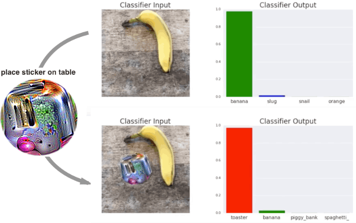

Midterm Exam
------------

Wednesday, February 26th

Generalizing Out of Distribution
================================

---

- AI systems often fail in unfamiliar scenarios
- Out-of-distribution (OOD) data poses significant challenges

What is Out-of-Distribution?
----------------------------

- Data different from training set
- Unseen or rare examples

Why is OOD Important?
---------------------

- Real-world data is diverse and unpredictable
- Safety and reliability in critical applications

Common OOD Scenarios
--------------------

- New environments
- Unseen object categories
- Unexpected interactions

Zillow Offers
-------------

- Used AI/ML to partially automate house flipping
- Unforseen events, such as the COVID-19 pandemic caused issues
- Cut 25% of the company’s workforce — about 2,000 employees

Self-driving
------------

- [Tesla driver from Canton killed in crash while using car's 'Autopilot'](https://www.news5cleveland.com/news/national/tesla-driver-from-canton-killed-in-crash-while-using-cars-autopilot)
- "Tesla said on its website that neither the driver nor the Autopilot noticed the white side of the trailer, which was perpendicular to the Model S, against the brightly lit sky, and neither applied the brakes."

Adversarial Attacks
-------------------

- Models can be analyzed against crafted inputs
- [Adversarial Patch](https://arxiv.org/pdf/1712.09665)

---

ELIZA
-----

- Chatbot to act as a therapist
- Simple rule-based system
- Defeated ChatGPT in at least [one Turing test](https://arxiv.org/abs/2310.20216)

---

Out of Distribution
-------------------

- Many models are good a learning patterns in data
- These will struggle when shown data that is unlike any they have seen
