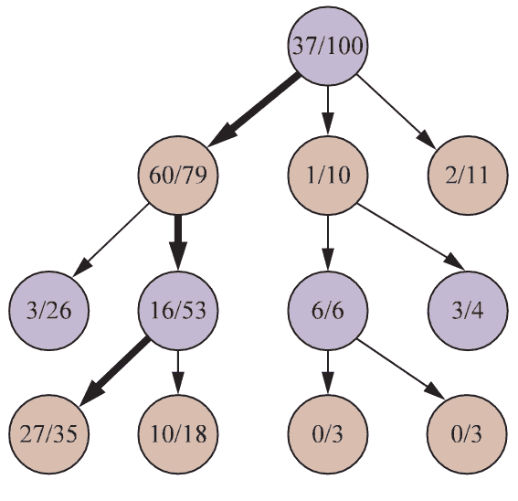
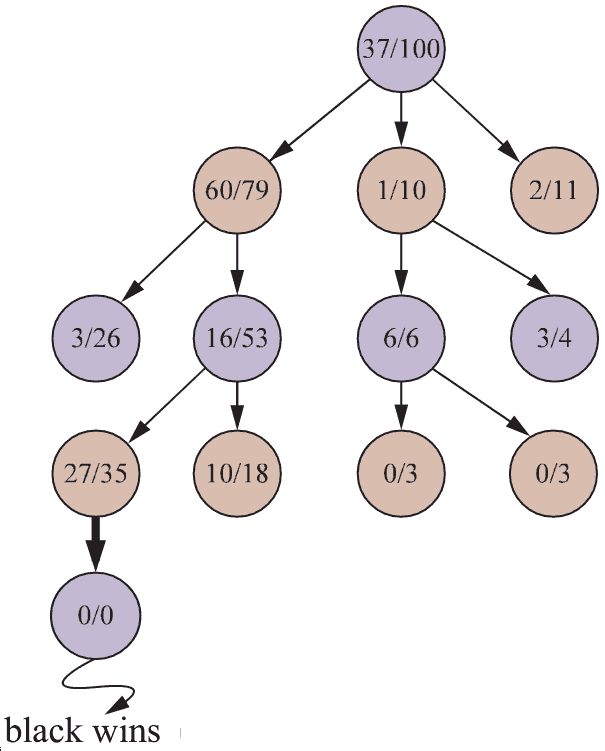
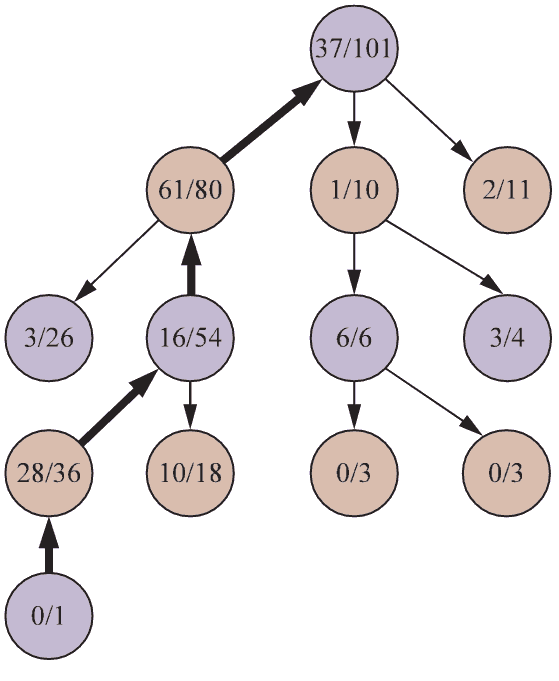

Search Algorithms
================

---

A search algorithm takes as input a search problem and returns a valid solution

Process
-------

- Begin at the start state
- Expand the node by considering possible actions
- Generate a new node for each resultant state
- Continue this process

Frontier
--------

- Nodes in the search tree that have not been expanded
- A node that has been generated (whether expanded or not) has been **reached**

---

How do we decide which node to expand next as we search?

Best First Search
-----------------

- Choose the node with the minimal value for some evaluation function
- e.g. shortest distance to the final destination

Dijkstra's Algorithm
--------------------

- Best First Search using path cost as the evaluation function
- Also known as *Uniform-Cost Search* in AI and when the search graph is expanded on the fly

---

{height=540px}

Breadth First Search
--------------------

- Expand all nodes on the same level of the tree before moving to the next level
- Identical to best-first search using node depth as the evaluation function

Depth First Search
------------------

- Fully expand the first node before moving to the next
- May not return optimal solution

---

Why would we use depth first search?

Memory
------

- Depth first search requires linear rather than exponential memory
- Depth first search uses a very basic recursive algorithm

Depth-First Search
------------------

```
procedure DFS(G, v) is
    label v as reached
    for all directed edges from v to w that are in G.adjacentEdges(v) do
        if vertex w is not labeled as reached then
            recursively call DFS(G, w)
```

Performance
-----------

- Searching a nearly infinite space will take nearly infinite time
- Using highly optimized software can help
- Using very powerful hardware can help

Heuristics
----------

- It is often much more efficient to pursue a course that is good enough, but not optimal
- We can employ various metrics to determine whether a course is likely to result in a positive outcome
- A heuristic is **admissible** if it never overestimates the cost of reaching the goal (the estimate won't cause us to miss the shortest path)

A*
---

---

{height=540px}

---

{height=540px}

---

{height=540px}

Monte Carlo Tree Search
=======================

Go
--

- Turn-based game typically played on a 19x19 board
- Players take turns placing a stone on the board
- Goal it to surround more territory than your opponent

---


Go complexity
-------------

- Hundreds of legal moves per turn
- Hundreds of total moves per game
- Total game tree complexity is approximately ${250}^{150}$ or ${10}^{360}$

Go Search
---------

- Search space is far too large even for a modest search depth
- e.g. searching 4 plies (player turns) ahead would be ${250}^4$ or 3.9 billion nodes
- Difficult to apply heuristics to determine who is winning a given position

Monte Carlo Method
------------------

- Algorithms that rely on random sampling to obtain results
- Used in physics, engineering, ray tracing, and applied statistics

Monte Carlo Tree Search
-----------------------

- Does not use heuristic evaluation
- Estimates the value of states by running simulations of complete games
- Average utility simply become win/loss percentage for simple games

Playout Policy
--------------

- How do we decide which moves to play in our simulations?
- Ideally, we would play optimal moves for both players, but if we knew these we wouldn't need MCTS
- Random moves can work for simple games

Pure Monte Carlo Search
-----------------------

- Runs `n` simulations for each legal move from the current game state
- Select the move with the highest expected utility
- Increasing `n` improves performance and requires additional compute

Selection Policy
--------------

- We can extend pure Monte Carlo search by exploring nodes that are more important
- Balance exploration and exploitation
- Exploration - getting more information for states with few playouts
- Exploitation - getting more information about states that have done well in past playouts

Search Tree Growth
------------------

1. Selection - Use selection policy to descend tree to leaf node
2. Expansion - Generate a new node
3. Simulation - Perform playout from new node
4. Backpropogation - Send results back up the tree

---

{height=540px}

---

{height=540px}

---

{height=540px}

MCTS Advantages
---------------

- No need for heuristic design
- Much smaller search tree compared to full search
- Can play games with only knowledge of the rules (simple form of reinforcement learning)
