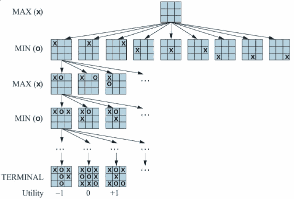

Game Theory
===========

Competitive Environments
------------------------

- Multi-agent - more than one system is making decisions
- Adversarial - the systems do not share the same goals

Stances
-------

1. Economy - consider agent decisions in aggregate
2. Environment - consider agents as random elements of the environment
3. Model opposing agent - treat the opposing agent as intelligent and consider their behavior

Simple games
------------

- Two player - only two agents
- Zero-sum - what is good for one player is bad for the other
- Perfect information - fully observable
- Turn-based

Formal Definition
-----------------

- $S_0$ - the initial state
- $Player(s)$ - the player whose turn it is in state `s`
- $Actions(s)$ - the set of legal moves in state `s`
- $Result(a, a)$ - transition model
- $IsTerminal(s)$ - True if game is over
- $Utility(s, p)$ - Assigns final score to player

Game Tree
---------

- We can convert the game model to a tree that can be searched

---



State space
-----------

- Becomes large quickly
- A simple game like Tic-tac-toe includes 9! = 362,880 nodes
- Chess includes over $10^{40}$ nodes

Optimal Decisions
-----------------

- We need a way to define optimal decision in competitive environments

Minimax
-------

- We focus maximizing our utility for a worst case (maximum loss) scenario
- Our opponent is trying to minimize our utility
- Minimax decision leads to the state with the highest (from `max` point of view)  minimax value

---


---

```python
def minimax(node, depth, maximizingPlayer):
  if depth = 0 or node is terminal_node:
    return the heuristic value of node
  if maximizingPlayer:
    value = −∞
    for child in node:
      value = max(value, minimax(child, depth − 1, FALSE))
    return value
  else: # Minimizing player
    value = +∞
    for child in node:
      value = min(value, minimax(child, depth − 1, TRUE))
    return value
```

Minimax complexity
------------------

- Performs complete depth-first search
- Exponential time performance with the number of legal moves per turn and tree depth

Pruning
-------

Our search space will generally be too large to fully explore, so we will prune branches that are not work pursuing

---

How do we decide what to prune?
 
Pruning Decisions
-----------------

- Use a heuristic to determine who is winning in a given state
- Or simulate many games from that state and use the average to determine the quality of the state

Alpha-beta Pruning
------------------

- We can't fully avoid the exponential growth
- We can improve performance by not exploring branches that can have no impact on the outcome

---


---

```python
def alphabeta(node, depth, α, β, maximizingPlayer):
  if depth = 0 or node is terminal_node:
    return the heuristic value of node
  if maximizingPlayer:
    value = −∞
    for child in node:
      value = max(value, 
                  alphabeta(child, depth−1, α, β, FALSE))
      α = max(α, value)
      if α ≥ β then
        break (* β cutoff *)
    return value
  else:
    value = +∞
    for child in node:
      value = min(value,
                  alphabeta(child, depth−1, α, β, TRUE))
      β = min(β, value)
      if β ≤ α then
        break (* α cutoff *)
    return value
```

Forward pruning
---------------

- Prune nodes that appear less good based on a heuristic
- May not return optimal results

Beam search
-----------

- Type of forward pruning
- Consider only the top-n nodes based on a heuristic when searching
- Identical to breadth-first search when beam width is infinite

Weaknesses
----------

- Missing good moves that look weak in the present but play out favorably
- Pushing moves over the horizon
- [Move horizon example](https://lichess.org/editor/3p2k1/4p3/8/5K2/8/1N6/8/r1r5_b_-_-_0_1)

Lookup
------

- The first moves of a game are the most expensive to search
- As an optimization, we may simply choose to lookup the winningest first move from a database of games
