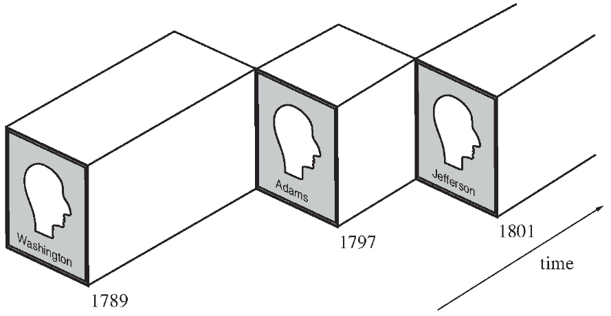

Logical Agents
==============

Knowledge-based agents
----------------------

- Apply a reasoning process to knowledge representation to make decisions

Knowledge Base
--------------

- Central component of knowledge-based agents
- Stores knowledge as **sentences** in a knowledge representation language asserting facts about the world

Updates
-------

- Tell - Add new information
- Ask - query for information

Ontologies
----------

- Formal representations of knowledge in a domain
- Ontology engineering studies the methodologies for building useful ontologies

---

Categories
----------

- Group similar objects
- Reasoning often takes place at the level of categories
- For example, a self-driving car will make decisions about pedestrians as a category without considering which individual pedestrians are nearby

First-order logic
-----------------

- Treating categories as objects in first-order logic can provide useful reasoning tools
- Membership: ${Bob} \in {Students}$
- Subcategories: ${Students} \subset {People}$

Inheritance
-----------

- Reasoning can be inherited through categories
- If we know that people have birthdates, then we know that Bob has a birthdate

Taxonomies
----------

- We can use properties of objects to create further categories

$$
\begin{gather}
Orange(x) \land Round(x) \land \\ 
Diameter(x) = 9.5 \land x \in Balls \Rightarrow \\
x \in Basketballs
\end{gather}
$$

Disjoint subcategories
----------------------

- Set of subcategories that have no members in common
- For example, {trucks, scooters} could be defined as disjoint subcategories of vehicles

Exhaustive Decomposition
------------------------

- A set of subclasses that contain all members of the parent class
- For example, {vowel, consonant} would be an exhaustive decomposition of letters

Partition
---------

- An exhuastive decomposition that is also disjoint.
- For example, {First-years, sophomores, juniors, seniors} is a partion of undergrad students.

Physical Composision
--------------------

- In addition to subsets, it can be helpful to denote how different entities relate to one another
- For example, counties in Indiana would be a part of Indiana

Composite Objects
-----------------

- Characterized by relations among parts

Natural kinds
-------------

- Real objects are imperfect
- A logical agent may care more about understanding what is typical
- How would a logical agent tell a deformed peach from a deformed apple?

Time Intervals
--------------

- Many facts only apply when specific other qualifiers, such as time, are satisfied
- It can be useful to think of entities in the abstract, in additional to the concrete
- Who is the president of the United States?

President
---------

- When the Constitution refers to the president, it is not reference a particular individual
- We often do want to refer to specif people who held the position

