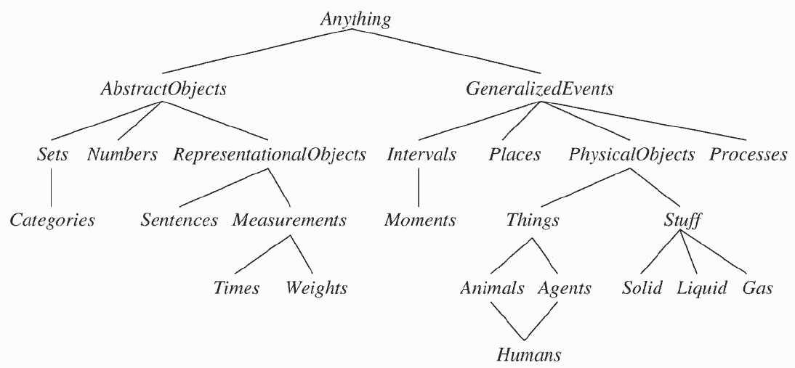

Logical Agents
==============

Knowledge-based agents
----------------------

- Apply a reasoning process to knowledge representation to make decisions

Knowledge Base
--------------

- Central component of knowledge-based agents
- Stores knowledge as **sentences** in a knowledge representation language asserting facts about the world

Updates
-------

- Tell - Add new information
- Ask - query for information

Ontologies
----------

- Formal representations of knowledge in a domain
- Ontology engineering studies the methodologies for building useful ontologies

---

Categories
----------

- Group similar objects
- Reasoning often takes place at the level of categories
- For example, a self-driving car will make decisions about pedestrians as a category without considering which individual pedestrians are nearby

First-order logic
-----------------

- Treating categories as objects in first-order logic can provide useful reasoning tools
- Membership: ${Bob} \in {Students}$
- Subcategories: ${Students} \subset {People}$

Inheritance
-----------

- Reasoning can be inherited through categories
- If we know that people have birthdates, then we know that Bob has a birthdate

Taxonomies
----------

- We can use properties of objects to create further categories

$$
\begin{gather}
Orange(x) \land Round(x) \land \\ 
Diameter(x) = 9.5 \land x \in Balls \Rightarrow \\
x \in Basketballs
\end{gather}
$$

Wikidata
========

Wikipedia
---------

- Encyclopedia that anyone can edit
- Over 300 editions of Wikipedia in different languages
- A single factual update requires editors to change 300 pages

---

> Wikidata is a collaboratively edited multilingual knowledge graph

> document-oriented database, focused on items, which represent topics, concepts, or objects

Entities
--------

- Identified by a unique id
- Description
- Optional aliases
- Statements

Claims
------

- Map values to properties of an entity
- Organized in groups of values mapped to properies
- Qualifiers determine when claims are applicable

Statements
----------

- Claims that include references
- Include rank to distinguish between multiple claims for the same property

---

---

Database size?

---

~90GB gzipped json as of 2021

More Information
----------------

- [Introduction](https://www.wikidata.org/wiki/Wikidata:Introduction)
- [Glossary](https://www.wikidata.org/wiki/Wikidata:Glossary)
