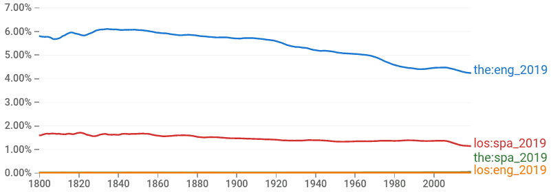

Lab Questions?

Natural Language Processing
===========================

Knowledge-based Agents
----------------------

- Use knowledge and reasoning to make decisions
- Perform best with vast and accurate knowledge bases

---

How do we acquire knowledge?

Knowledge Aquisition
--------------------

- Direct instruction
- Experience
- Reading

---

If computers could read and reason, they could become powerful agents simply by processing existing materials.

---

Language
--------

- Set of strings
- A **grammar** specifies rules for the language
- Meaning of the words is known as **semantics**

Ambiguity
---------

- Natural language is ambiguous
- We need systems that can cope with uncertainty

Language Models
---------------

- Predict the probability distribution of language expressions
- Simple models can be used for language identification

Character n-gram Model
----------------------

- Break sequences into n character chunks
- Track the probability of each n-gram
- Use probabilities to analyze likeliness of occurence to perform tasks such as language recognition

---

- "the" - very high probability
- "xfz" - very low probability

Entropy Coding
--------------

- Compression models that use likelihood of occurence to compress data

---

{height=540px}

Word n-gram Model
-----------------

- Break squences into groups of n words
- Track probaility of each word n-gram
- Apply probabilities for analysis and identification
- A unigram word model is often referred to as **bag of words**

---

[Google Ngrams](https://books.google.com/ngrams/graph?content=the%3Aeng_2019%2Clos%3Aspa_2019%2Cthe%3Aspa_2019%2Clos%3Aeng_2019&year_start=1800&year_end=2019&corpus=26&smoothing=3&direct_url=t1%3B%2Cthe%3Aeng_2019%3B%2Cc0%3B.t1%3B%2Clos%3Aspa_2019%3B%2Cc0%3B.t1%3B%2Cthe%3Aspa_2019%3B%2Cc0%3B.t1%3B%2Clos%3Aeng_2019%3B%2Cc0) 

Vocabulary
----------

- Word n-gram models have a fixed vocabulary
- What if we encounter out of vocabulary words?

Handling Unknown words
---------------------

- Count each word as unknown only the first time it is seen during training
- We may want additional unknown classes such as `ProperName`, `Number`, or `Email`

Text Classification
-------------------

- It is freqeuntly helpful to be able to classify or categorize text
- Is a tweet about our product positive or negative?
- Is an email spam?

Supervised Learning
-------------------

- Requires labelled examples
- Algorithm learns to identify class membership

Algorithm
---------

- Requires labelled data
- Compare occurences of n-grams in spam and ham messages
