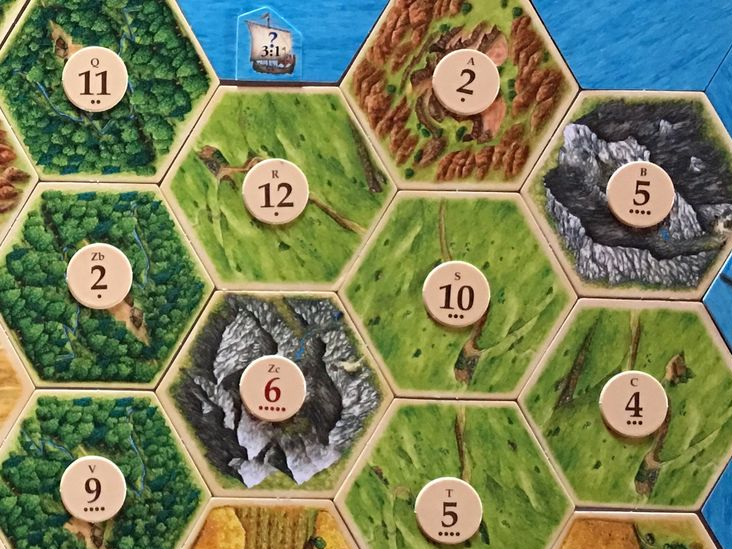

Probability
===========

---

Probility describes the likeliness of some event occuring

---

Dice
----

- A regular die has a 1 in 6 probability of rolling a 6
- $P(A=6) = {1 \over 6}$
- Why is the case?

Counting outcomes
-----------------

- A die result can be 1, 2, 3, 4, 5, or 6
- If we assume that the die is fair, then each outcome is equally probable
- Therefore, any of the outcomes will occur approximately one sixth of the time

---

What is the probability of two rolled die summing to 11?

---

[{height=540px}](https://docs.google.com/forms/d/e/1FAIpQLSe2fOdJf-wUgChMLChcYK2_VMxdc1dYitA7q8-NYSjqQUA-yQ/viewform?usp=sf_link)

---

[Results](https://docs.google.com/spreadsheets/d/1gf6t0-jj1JqtyaUQADxEyeL5Z3HFB9D80xC0eS_iQlw/edit)

---

{height=540px}

---



Conditional Probability
-----------------------

- How would we model the probability of events that depend on one another?
- What is the probability that someone is holding an umbrella?
- What is that probability if it is raining?

---

$$P(A \mid B) = \frac{P(A \cap B)}{P(B)}$$

- $\mid$ - Conditional probability
- $\cap$ - Intersection

---


Language Identification
=======================

---

Language identification (sometimes called language guessing) is the process of determining which natural language a text is written in.

Hand-crafted bag of words model
-------------------------------

- Identify common words in languages
- Examine frequency of the words

Examples
--------

- English - The cats are hungry
- Spanish - Los gatos tienen hambre

Simple model
------------

```python
if text.contains('los'):
  return 'Spanish'
if text.contains('the'):
  return 'English'
```

Example
-------

- English - The cat is hungry
- Spanish - El gato tiene hambre

Complexities
------------

- Engish has one common definite article (the)
- Spanish has at least 4 (el, la, los, las) to capture quantity and gender

Updated model
------------

```python
if text.contains('los') or
   text.contains('las') or
   text.contains('el') or
   text.contains('la'):
  return 'Spanish'
if text.contains('the'):
  return 'English'
```

---

What if an English text about singing references the note "la"?

---

What if we want to identify languages that we can't comprehend?

---

What if we can't even find word boundaries?

---

Continuous script
-----------------

- English - The cats are hungry
- Thai - แมวกำลังหิว

Character n-gram models
-----------------------

- Consider character n-grams instead of words
- Most frequent n-grams are not always intuitive

---

What is the most common trigram in English?

---

" th" is more common than "the" in most documents

---

What if we want to support all languages, not just a pair of languages?

---

- It quickly become tedious to program hundreds of rules to check for common n-grams from various languages in a text.
- As we add more languages, we also have more overlap between n-grams

Language Similarity
-------------------

- English - The cats are hungry
- Czech - Kočky mají hlad
- Slovak - Mačky majú hlad 

Machine learning
----------------

- Create a model that learns n-gram frequency
- Use this model to identify language membership

Perplexity
----------

- We can calculate probability of occurence mathematically
- We can also approximate this simply using frequency
