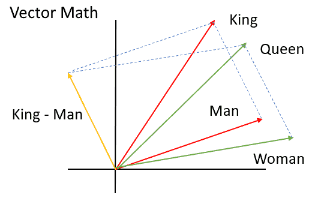

Lab Questions?

Vectors
=======

Vector
------

- Object with length and direction

---

Components
----------

- Often defined as a tuple of components that act as multipliers against basic vectors

---

{height=540px}

Basis
-----

- We commonly use the standard basis to represent vectors
- The standard basis vectors will have all components equal to zero, which the exception of one value that is one
- Standard basis vectors are therefore unit vectors

---

{height=540px}

Vector Addition
---------------

- We can add two vectors by simply adding their components (assuming the same basis)

---

{height=540px}

Vector Magnitude
----------------

- Provides the length of the vector as a scalar
- Also know as the Euclidean norm
- $\|a\| = \sqrt{a_1^2 + a_2^2 + \cdots + a_n^2}$

Vector Multiplication
---------------------

- There are many ways to apply a multiplication operation to vectors

Scalar Multiplication
---------------------

- Multiply each component of the vector by a scalar
- This changes the length of the vector
- This does not change the direction of the vector

---

Dot Product
-----------

- Sums the product of each vector component
- $a \cdot b=\sum_{i=1}^n a_i{b}_i={a}_1{b}_1+{a}_2{b}_2+\cdots+{a}_n{b}_n$
- $a \cdot b=\|a\|\ \|b\|\cos\theta$

Cosine Similarity
-----------------

- One measure for similarity between vectors is the angle between them
- One way to calculate this angle is by using the dot product and vector magnitude
- $\cos(\theta) = {a \cdot b \over \|a\| \|b\|}$
- Note that for unit vectors cosine similarity is the same as the dot product

Vector Magnitude
----------------

- With an understanding of the dot product, we have a new way to define magnitude
- $\|a\| = \sqrt{a \cdot a}$

---

[Python Example](https://repl.it/@jncraton/vector#main.py)

Applications
------------

- Physics
- Lighting
- SVG

Word Embeddings
===============

Word Meaning
------------

- AI algoritms that work on text need tools to reason about the meaning of words
- Modern computers are built around numbers
- How might we convert the meaning of a word into numbers?

Word Embeddings
---------------

- Create vectors to represent words
- Basis vectors could represent properties of a word
- Consider basis vectors such as `political power` and `gender`. How would a queen be represented? How would congressman be represented?

---

Learning Embeddings
-------------------

- It is tedious to the point of impossibility to manually create embeddings
- What if these could be learned from analyzing texts?

word2vec
--------

- Learns embeddings by analyzing nearby words in a large corpus
- Word similarity is defined as their cosine distance
