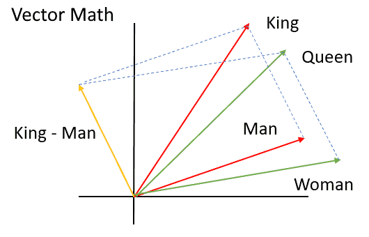

Word Embeddings
===============

Word Meaning
------------

- AI algoritms that work on text need tools to reason about the meaning of words
- Modern computers are built around numbers
- How might we convert the meaning of a word into numbers?

Word Embeddings
---------------

- Create vectors to represent words
- Basis vectors could represent properties of a word
- Consider basis vectors such as `political power` and `gender`. How would a queen be represented? How would congressman be represented?

---

Learning Embeddings
-------------------

- It is tedious to the point of impossibility to manually create embeddings
- What if these could be learned from analyzing texts?

word2vec
--------

- Learns embeddings by analyzing nearby words in a large corpus
- Word similarity is defined as their cosine distance

Example
-------

=====

---

> spaCy is a free, open-source library for advanced Natural Language Processing (NLP) in Python.

Features
--------

- Tokenization
- Part-of-speech tagging
- Dependency parsing
- Lemmatization
- Entity Linking
- Text Classification

Tokenization
------------

- Segments input text into words or other tokens (punctuation)

Part-of-speech tagging
----------------------

- Determines part-of-speech (POS), such as noun, adjective, or verb for tokens

Dependency Parsing
------------------

- Assign relationships between tokens
- For example, subject and object

Lemmatization
-------------

- Convert tokens into standard base forms
- For example, schools => school or was => be

Entity Linking
--------------

- Maps tokens to knowledge base IDs

Text classification
-------------------

- Assigns labels or classes to documents

Example
-------
