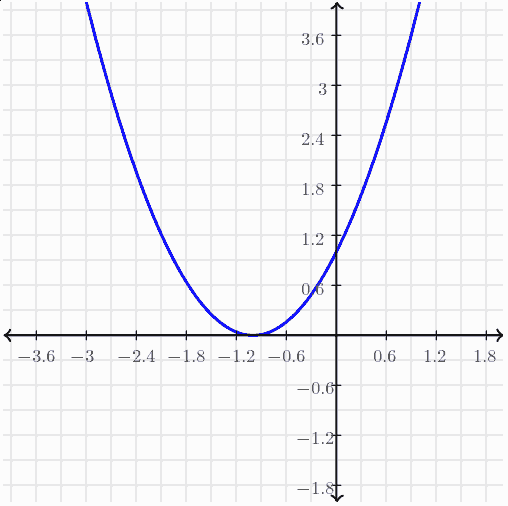

Loss Function
=============

Agents
------

- Map percept sequences to actions
- Use an internal model to determine an actions

Cost
----

- If we can determine the extent to which an action is good or bad, we can map decisions to quality using a **loss function**
- We can parameterize our loss function to convert learning problems into optimization problems

---

Consider the Heaviside step function:

$H(n)=\begin{cases} 0, & n < 0, \\ 1, & n \ge 0, \end{cases}$

--- 

{height=540px}


---

What would an agent look like that operates based on the Heaviside function?

---

```python
def agent(percept):
  if percept >= 0:
    return 1
  else:
    return 0
```

What if we didn't know what the function looked like, but we had access to examples?

---


Parameterized model

```python
x = # Learn this parameter

def agent(percept):
  if percept >= x:
    return 1
  else:
    return 0
```

Training process
----------------

- Inputs - [-2,-1,0,1,2]
- Loss function - sum of incorrect outputs over input
- Test all possible values for x, and determine which has the lowest cost

---

- What if x can hold infinitely many values?
- What if we have more variables?
- What if inputs and outputs are continous rather than discrete?

Gradient Descent
================

Calculus
--------

- Math of continuous change
- Can be used to compute rate of change
- Can also be used to compute the area under a curve

Minimization
------------

What is the minimum value of $x^2 + 2x + 1$?



Calculus solution
-----------------

- Calculate the derivative
- Find zeroes to determine point where rate of change is 0
- This will correspond to a minimum or maximum

---

- It can be hard to find solutions to for certain systems
- What if we can't find the derivative?
- What if the derivative is expensive to compute?

Gradient Descent
----------------

- Pick a point on the original function
- Calculate the slope or gradient at that point
- Pick a new point in the direction of the gradient

---

{height=540px}
