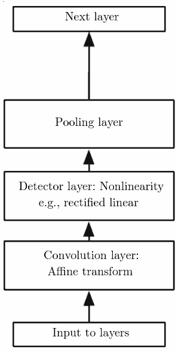

Deep Neural Networks with PyTorch
=================================

---

Single layer example

```python
class Net(nn.Module):
    def __init__(self, input_dim = 2, output_dim=1):
        super(Net, self).__init__()
        # Create a linear layer mapping inputs to one output
        self.linear = nn.Linear(2, output_dim)
    
    def forward(self, x):
        # Connect the linear layer to a sigmoid (logistic) function
        x = self.linear(x)
        x = torch.sigmoid(x)
        return x
```

---

2 Layer example

```python
class Net(nn.Module):
    def __init__(self, input_dim = 2, output_dim=1):
        super(Net, self).__init__()
        self.lin1 = nn.Linear(input_dim, 2)
        self.lin2 = nn.Linear(2, output_dim)
    
    def forward(self, x):
        x = self.lin1(x)
        x = torch.sigmoid(x)
        x = self.lin2(x)
        return x
```

---

Multilayer example

```python
    def __init__(self):
        super(Net, self).__init__()
        self.conv1 = nn.Conv2d(1, 32, 3, 1)
        self.conv2 = nn.Conv2d(32, 64, 3, 1)
        self.dropout1 = nn.Dropout(0.25)
        self.dropout2 = nn.Dropout(0.5)
        self.fc1 = nn.Linear(9216, 128)
        self.fc2 = nn.Linear(128, 10)

    def forward(self, x):
        x = self.conv1(x)
        x = F.relu(x)
        x = self.conv2(x)
        x = F.relu(x)
        x = F.max_pool2d(x, 2)
        x = self.dropout1(x)
        x = torch.flatten(x, 1)
        x = self.fc1(x)
        x = F.relu(x)
        x = self.dropout2(x)
        x = self.fc2(x)
        output = F.log_softmax(x, dim=1)
        return output
```

Convolutional neural networks
-----------------------------

- Chapter 9 in Deep Learning
- Begin with convolutional layers to detect features
- Subsample via max pooling
- Followed by fully connected layers
- Finished up with softmax to determine classes

---

{height=540px}

Training
--------

- Takes a large amount of time/money for significant networks
- PyTorch provides [pretrained models](https://pytorch.org/hub/) that can be fine-tuned or used as is
- HuggingFace provides a number of pre-trained transformer models
- Google Colab can be used to get access to a free persistent GPU

Projects
--------

- Represent significant work in AI and/or machine learning
- Can be an enhancement or extension of a lab
- Can be a small group project
- Class attendance is expected time devoted to project work after daily standup
- Grade will be based on class participation and final presentation
