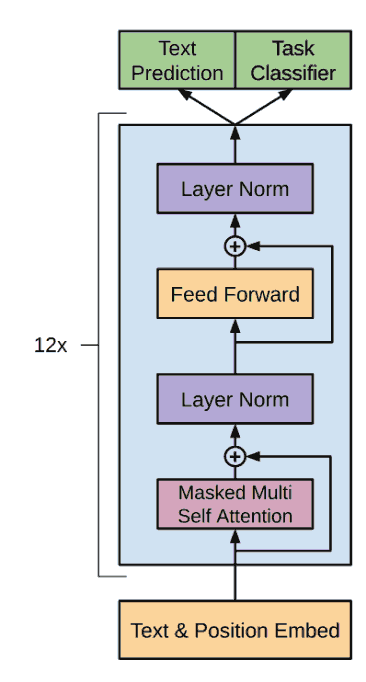
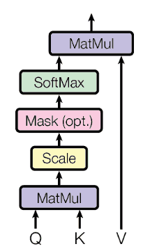
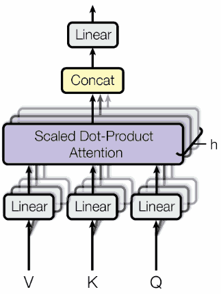

Recurrent Neural Network
========================

---

Properties
----------

- RNNs naturally maintain state over time
- Have difficulties with long-range dependencies
- Difficult to parallelize and scale

Transformers
============

---

)](media/transformer.png){height=540px}

---

{height=540px}

---

Attention
---------

---

---

Self-attention Advantages
-------------------------

- Reduced computational complexity per layer
- Increased parallelism
- Reduced path length for long-range dependencies