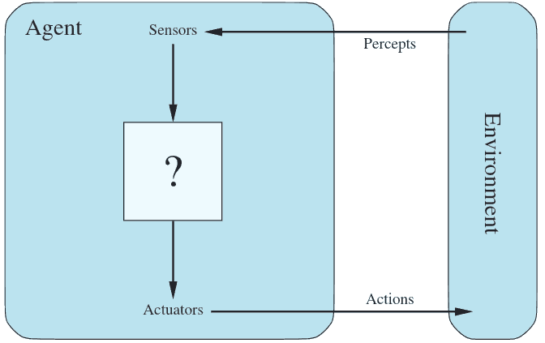

Agents
======
---

Agent
-----

- Perceives **environment** and acts using **actuators**
- **Sensors** return knowledge about the environment

Percepts
--------

- The content that an agent is perceiving
- A percept seqence refers to the complete history of observations

Agent Function
--------------

- Maps a percept sequence to an action
- The agent program executes the agent function

---

Rationality
-----------

- A rational agent does the right thing
- What is the right thing?

Performance Measures
--------------------

---

- Simple reflex - only know current precepts
- Model-based reflex - stores previous precepts
- Goal-based - choose actions to achieve a goal
- Utility-based - optimizes a utility function related to several goals

