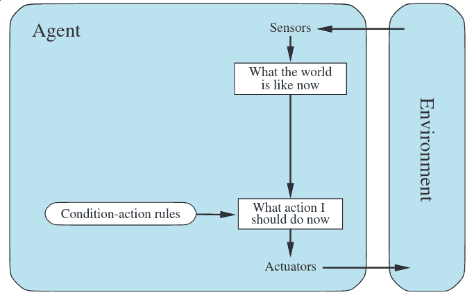

Agents
======
---

Agent
-----

- Perceives **environment** and acts using **actuators**
- **Sensors** return knowledge about the environment

Percepts
--------

- The content that an agent is perceiving
- A percept sequence refers to the complete history of observations

Agent Function
--------------

- Maps a percept sequence to an action
- The agent program executes the agent function

---

Rationality
-----------

- A rational agent does the right thing
- What is the right thing?

---

Performance Measures
--------------------

- It can be difficult to define right behavior
- It is best to use a performance measure based on desired outcome, not expected behavior

Rational Agent
--------------

1. Performance measure
2. Prior knowledge
3. Possible actions (actuators)
4. Percept sequence to date

Rational Agent
--------------

> For each possible percept sequence, a rational agent should select an action that is expected to maximize its performance measure, given the evidence provided by the percept sequence and whatever built-in knowledge the agent has
>
> -Norvig, 2.2.2

Omniscience
-----------

- Agents don't have complete information or perfect knowledge of the results of their actions
- We define rationality under these constraints

Exploration
-----------

- Sometimes the right choice in the present is to modify future percepts via information gathering

Learning
--------

- Prior knowledge should be combined with new percepts to form a complete knowledge base

Task Environment
----------------

- Performance metric
- Environment
- Actuators
- Sensors

Observability
-------------

- Fully observable - sensors have access to complete environment (Chess)
- Partially observable - sensors have access to some of environment (Counter-strike)
- Unobservable - no sensors

Multiagent
----------

- Some environments have additional agents to consider
- Competitive - other agents are opposed to you
- Cooperative - other agents share your goals

Determinism
------------

- Deterministic - Next state is fully determined by the current state and actions taken (Chess)
- Non-deterministic - Next state includes some randomness (Risk)

---

Agent Programs
--------------

- Simple reflex - only know current precepts
- Model-based reflex - stores previous precepts
- Goal-based - choose actions to achieve a goal
- Utility-based - optimizes a utility function related to several goals

Simple Reflex
-------------

- Make decisions from percepts using **condition-action rules**

---

Model-based Reflex
------------------

- Track the part of the environment they have seen but can't currently observe
- Internal state is used to maintain knowledge from prior percepts

---

Goal Based
----------

- Seek a particular goal
- May implement search or planning algorithms

---

Utility Based
-------------

- In addition to a final goal we may also be interested in other things such as points or time to a destination
- Utility helps to capture these performance considerations

---

Learning Agents
---------------

- It can become difficult or impossible to fully program an agent
- We might prefer to be able to have the agent learn rules on its own

---

