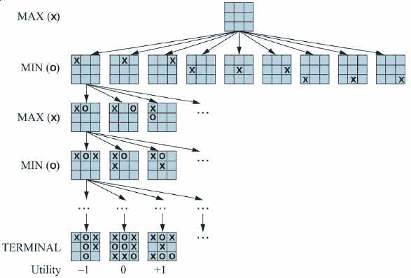

Game Theory
===========

Competitive Environments
------------------------

- Multi-agent - more than one system is making decisions
- Adversarial - the systems do not share the same goals

Stances
-------

1. Economy - consider agent decisions in aggregate
2. Environment - consider agents as random elements of the environment
3. Model opposing agent - treat the opposing agent as intelligent and consider their behavior

 Pruning
 -------

 Our search space will generally be too large to fully explore, so we will prune branches that are not work pursuing
---

How do we decide what to prune?
 
Pruning Decisions
-----------------

- Use a heuristic to determine who is winning in a given state
- Or simulate many games from that state and use the average to determine the quality of the state

Simple games
------------

- Two player - only two agents
- Zero-sum - what is good for one player is bad for the other
- Perfect information - fully observable
- Turn-based

Formal Definition
-----------------

- $S_0$ - the initial state
- $To-Move(s)$ - the player whose turn it is in state `s`
- $Actions(s)$ - the set of legal moves in state `s`
- $Result(a, a)$ - transition model
- $IsTerminal(s)$ - True if game is over
- $Utility(s, p)$ - Assigns final score to player

Game Tree
---------

- We can convert the game model to a tree that can be searched

---

State space
-----------

- Becomes large quickly
- A simple game like Tic-tac-toe includes 9! = 362,880 nodes
- Chess includes over $10^40$ nodes

Optimal Decisions
-----------------

