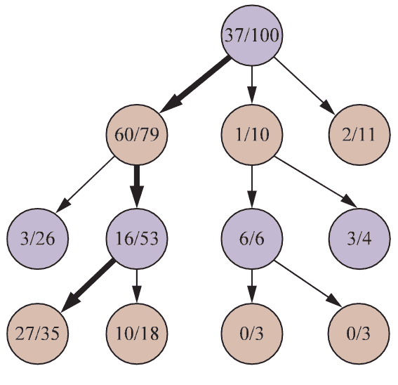
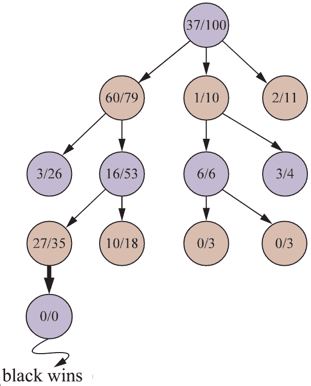
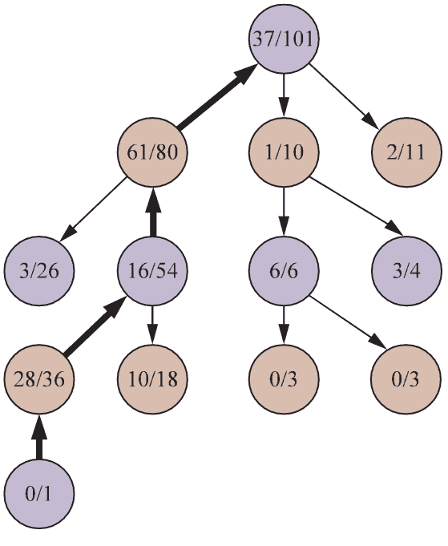

Monte Carlo Tree Search
=======================

Go
--

- Turn-based game typically played on a 19x19 board
- Players take turns placing a stone on the board
- Goal it to surround more territory than your opponent

---

Go complexity
-------------

- Hundreds of legal moves per turn
- Hundreds of total moves per game
- Total game tree complexity is approximately ${250}^{150}$ or ${10}^{360}$

Go Search
---------

- Search space is far too large even for a modest search depth
- e.g. searching 4 plies (player turns) ahead would be ${250}^4$ or 3.9 billion nodes
- Difficult to apply heuristics to determine who is winning a given position

Monte Carlo Method
------------------

- Algoithms that rely on random sampling to obtain results
- Used in physics, engineering, ray tracing, and applied statistics

Monte Carlo Tree Search
-----------------------

- Does not use heuristic evaluation
- Estimates the value of states by running simulations of complete games
- Average utility simply become win/loss percentage for simple games

Playout Policy
--------------

- How do we decide which moves to play in our simuations?
- Ideally, we would play optimal moves for both players, but if we knew these we wouldn't need MCTS
- Random moves can work for simple games

Pure Monte Carlo Search
-----------------------

- Runs `n` simulations for each legal move from the current game state
- Select the move with the highest expected utility
- Increasing `n` improves performance and requires additional compute

Selection Policy
--------------

- We can extend pure Monte Carlo search by exploring nodes that are more important
- Balance exploration and exploitation
- Exporation - getting more information for states with few playouts
- Expoitation - geting more information about states that have done well in past playouts

Search Tree Growth
------------------

1. Selection - Use selection policy to descend tree to leaf node
2. Expansion - Generate a new node
3. Simulation - Perform playout from new node
4. Backpropogation - Send results back up the tree

---

{height=540px}

---

{height=540px}

---

{height=540px}

MCTS Advantages
---------------

- No need for heuristic design
- Much smaller search tree compared to full search
- Can play games with only knowledge of the rules (simple form of reinforcement learning)
